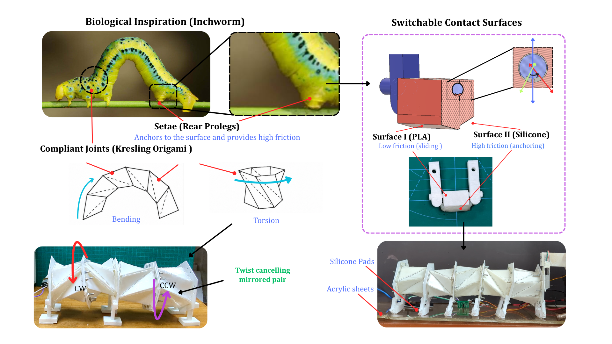
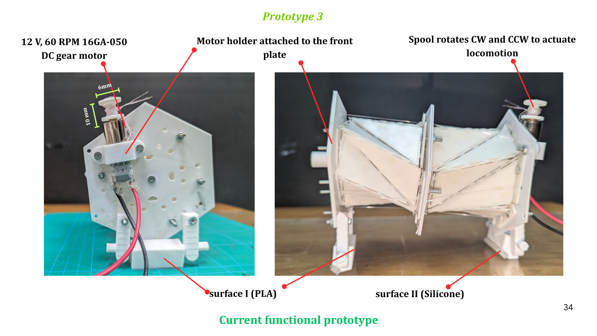
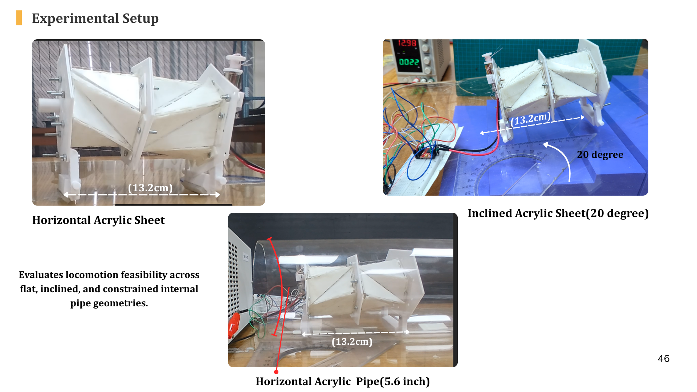

# Kresling Origami Inchworm Robot

**Design and experimental characterization of a Kresling-origami inchworm robot for pipeline inspection and proprioceptive corrosion detection.**

## Overview

This project presents an inchworm-inspired modular crawling robot based on
Kresling origami structures. The robot is designed for locomotion inside
confined pipe environments using a minimal actuation architecture.

The work combines origami-based mechanical design, compliant contact,
embedded sensing, and experimental characterization toward pipeline
inspection and defect localization.

## Design

The robot uses modular Kresling-origami structures to reproduce the
contraction and extension behavior of an inchworm. The mechanical design
incorporates rigid end plates, compliant feet, passive restoring elements,
and tendon-driven actuation.

## Experimental Characterization

The prototype was experimentally evaluated to characterize its mechanical
and locomotion performance. Experiments included:

- Locomotion speed and gait behavior
- Compression and rebound characteristics
- Actuation force measurement
- Contact and material effects
- Mechanical performance and efficiency

## Demonstrations

- [Robot locomotion](flat_acrylic_sheet_video.mp4)
- [Experimental testing](inclined_plane_video.mp4)

## Sensing and Electronics

The project incorporates embedded electronics and proprioceptive sensing
for monitoring the robot's internal mechanical and motion states, with the
long-term objective of detecting and localizing pipeline corrosion.

## Research Status

**Ongoing undergraduate research project.**

Current work focuses on experimental validation and the development of
sensor-based methods for defect detection and localization.

## Project Presentation

A selected presentation covering the robot concept, mechanical design,
fabrication, experimental setup, and results is available below.

[View Project Presentation](PROJECT_PRESENTATION.pdf)

## Technologies

- Autodesk Fusion 360
- ANSYS Workbench
- ESP32
- Embedded sensing and motor control
- Kresling origami structures
- Experimental characterization
